# EE538 Final Project Report - Fall 2021 - TrojanMap

**Hello there, please grade Zijian Ye's github https://github.com/ee538/final-project-ZijianYe  Thank you!**

## Group members: Zixin Zhang, Zijian Ye

## Presentation video link: https://youtu.be/JyVr2JuwS1s

## Step1: Autocomplete the location name：
For this function, we are going to conside the names of nodes as the locations. In the input, we typed in the name prefix of the location, and the output will give us the partial name of the prefix we typed in. Besides, we need to treat the uppercase and lowercase as the same character.

First, we transform the input name and all the location name of data to lowercase. And we set a flag to 1, if the input name size bigger than the location name of data, we change the flag to 0, if not, we go through the location name of data with size of input name. Then, we push back the result to the vector.

**Time complexity:** O(n*name.size()). n represents the number of nodes in the map. name.size() represents the number of characters of the input name. In the trojan map, there are 2237 nodes totally. The fist for-loop costs O(n) and the second for-loop costs O(name.size()).


**Examples and Time taken by function:**

Input: "ch" \
Output: ["ChickfilA", "Chipotle Mexican Grill"]

Input: "cr" \
Output: ["Crosswalk2", "Crosswalk1","Crosswalk3"]

```shell
**************************************************************
* 1. Autocomplete                                             
**************************************************************

Please input a partial location:ch
*************************Results******************************
ChickfilA
Chipotle Mexican Grill
**************************************************************
Time taken by function: 5594 microseconds

**************************************************************
* 1. Autocomplete                                             
**************************************************************

Please input a partial location:cr
*************************Results******************************
Crosswalk2
Crosswalk1
crosswalk3
**************************************************************
Time taken by function: 5822 microseconds
```

## Step2: Find the place's coordinates in the map:
For this function, the input is the location name. And we want the latitude and longitude of the location name in the output. If the given location does not exist, then return (-1,-1).

First, we find the node of the input location name. Second, we go through the node of data, if the node name is the input location name, then we return the latitude and longitude. If not, we return (-1,-1).

**Time complexity:** O(n*name.size()). n represents the number of nodes in the map. The for-loop costs O(n) and if-statement comparing two strings costs O(name.size()).

**Examples and Time taken by function:**

Input: "ChickfilA" \
Output: (34.0167, -118.283)

Input: "Tap Two Blue" \
Output: (34.0312, -118.274)

Input: "crosswalk3" \
Output: (34.0284, -118.287)

```shell
* 2. Find the position                                        
**************************************************************

Please input a location:ChickfilA
*************************Results******************************
Latitude: 34.0167 Longitude: -118.283
**************************************************************
Time taken by function: 1476 microseconds
```
<p align="center"></p>

```shell
**************************************************************
* 2. Find the position                                        
**************************************************************

Please input a location:Tap Two Blue
*************************Results******************************
Latitude: 34.0312 Longitude: -118.274
**************************************************************
Time taken by function: 1185 microseconds
```
<p align="center"></p>

```shell
**************************************************************
* 2. Find the position                                        
**************************************************************

Please input a location:crosswalk3
*************************Results******************************
Latitude: 34.0284 Longitude: -118.287
**************************************************************
Time taken by function: 4242 microseconds
```
<p align="center">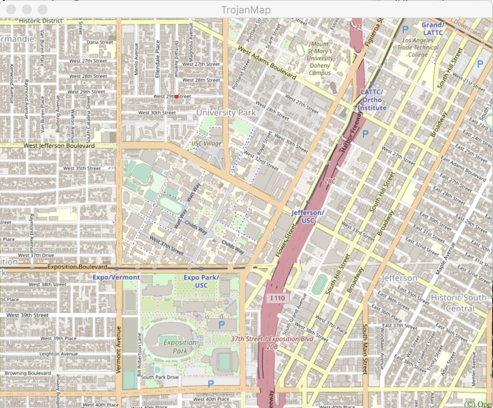</p>


## Step3: CalculateShortestPath between two places:
### 1. Dijkstra
We use ```priority_queue``` to implement Dijkstra Algorithm. The input is the names of start locaton and end location. We expect the shortest path between these two locations.

- First, we initialize the unordered_map ```distance```, which records the shortest distance value between the location and the source node. The values of ```distance``` are set to INT_MAX and we assign distance value as 0 for the source node, so that it can be picked first.
- Then we use priority_queue ```q```, which is the min-heap, to record the pair of the shortest distance to the start node and the location id. Hence, fine the node with the shortest distance can just cost O(logn).
- While ```q``` is not empty, we implement edge relaxation. We choose a ```min_node``` with the shortest distance to the source node. Iterate through all the neighbors of ```min_node```, for every neighbor, if the new distance value (go through ```min_node```) is less than the original one, then its distance value will be updated. 
- When implementing edge relaxation, we use unordered_map ```pre``` to record the predecessor of the node. If the distance value of min_node's neighbor is updated, then the predecessor of the neighbor is ```min_node```.
- When ``min_node`` is the destination node, we break the while loop. Then the shortest distance tree from the source node to the destination node can be got with the help of ```pre```.

**Time complexity:** O((m+n)*logn). m represents the number of edges and n represents the number of nodes.

```while (!q.empty())``` runs n times, and ```q.pop``` costs O(logn). The for-loop ```for (auto &i:neigh)``` totally costs O(m)(there are m edges) and ```q.push()``` costs O(logn). Therefore time complexity of the function is O((m+n)*logn).


**Examples and Time taken by function:**
```shell
**************************************************************
* 3. CalculateShortestPath                                    
**************************************************************

Please input the start location:Ralphs
Please input the destination:ChickfilA
*************************Results******************************

The distance of the path is:1.53852 miles
**************************************************************
Time taken by function: 21256 microseconds
 ```
<p align="center"></p>

```shell
* 3. CalculateShortestPath                                    
**************************************************************

Please input the start location:Target
Please input the destination:ChickfilA
*************************Results******************************

The distance of the path is:0.841394 miles
**************************************************************
Time taken by function: 15594 microseconds
```
<p align="center"></p>


### 2. Bellman-Ford
In this section, we implement Bellman-Ford algorithm. 
- First, we initialize a map ```distance``` of size n(n represents the number of nodes) with all distance values from the source to other nodes as infinite(INT_MAX) except the ```dist[start]```, which is 0.
- Then we do edge relaxation for n-1 times. Because the source node to any other node in the map can have at most n-1 edges. 
- When implementing edge relaxation, we use a map ```pre``` to record the predecessor of the node so that we can get a shortest path tree in the end. And we also set a flag, when there is no change in an edge relaxation, which means the shortest path tree strike a balance, we will break the loop.
- Finally, we can get the shortest path with the help of ```pre```.

**Time complexity:** O(n*m), n represents the number of nodes and m represents the number of edges in the map.

Because we will implement edge relaxations O(n) time and evry edge relaxation costs O(m). Therefor the time complexity if O(n*m).

**Examples and Time taken by function:**
```shell
* 3. CalculateShortestPath                                    
**************************************************************

Please input the start location:Ralphs
Please input the destination:ChickfilA
*************************Results******************************

The distance of the path is:1.53852 miles
**************************************************************
Time taken by function: 303327 microseconds
```
<p align="center">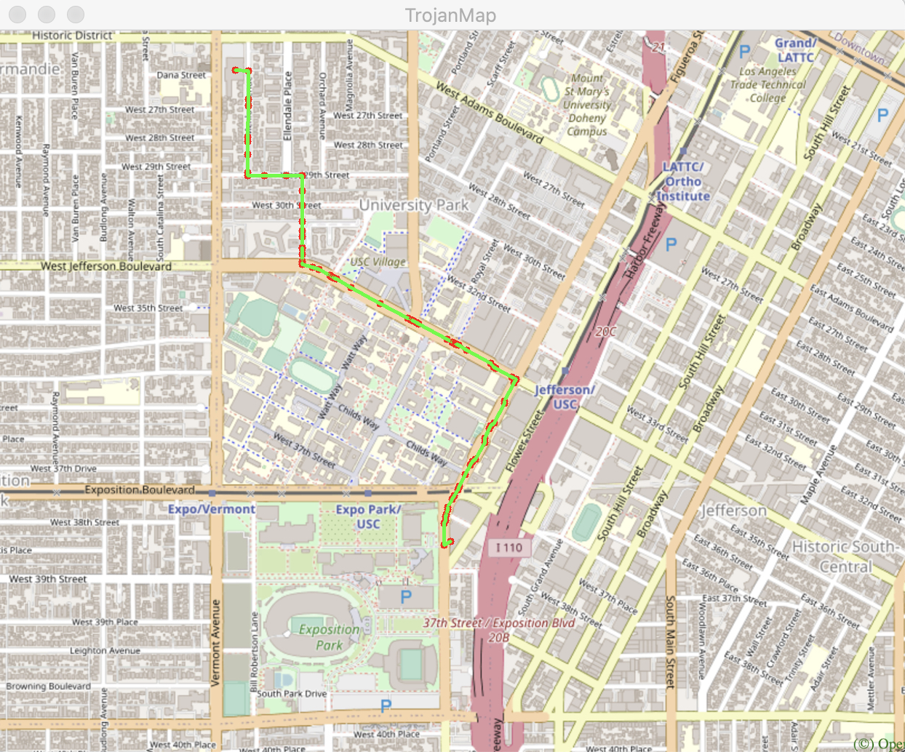</p>

```shell
* 3. CalculateShortestPath                                    
**************************************************************

Please input the start location:Target
Please input the destination:ChickfilA
*************************Results******************************

The distance of the path is:0.841394 miles
**************************************************************
Time taken by function: 271712 microseconds
```
<p align="center">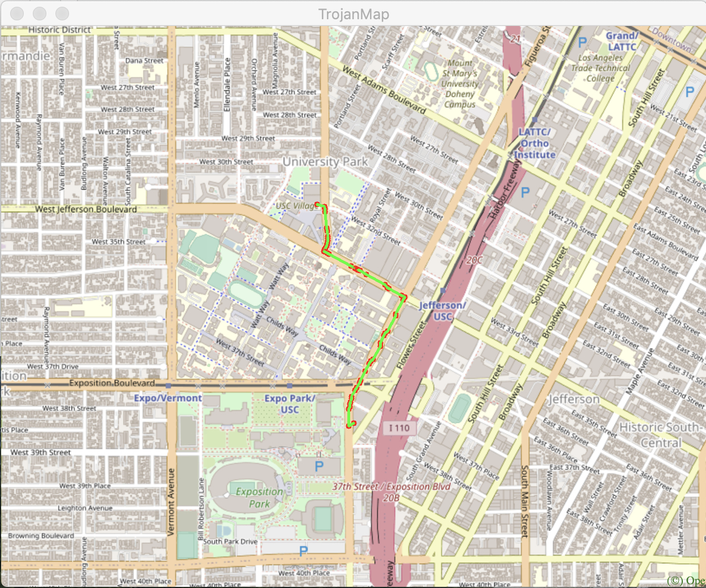</p>

As we can the results from Dijkstra and Bellman-ford are identical. However, Bellman-ford costs much more time than Dijkstra.


### 3. Runtime compard between Dijkstra and Bellman-Ford
We listed 10 examples to compare the runtime between Dijkstra and Bellman_Ford. There are totally 2237 nodes in the map. We implement the two algorithms over these 2237 nodes.

Dijkstra choose the nodes with the minimum distance to the source that hasn't been visited, and do the edge relaxation process on all of its outgoing edges. While Bellman-Ford just do edge relaxation for all edges in the map and do this n-1 times. n is the number of nodes. Bellman-Ford performs check on all the nodes, while Dijkstra just check the one with the shortest distance. Therefore, when there is no negative edges, Dijkstra performs better than Bellman-Ford.

<p align="center">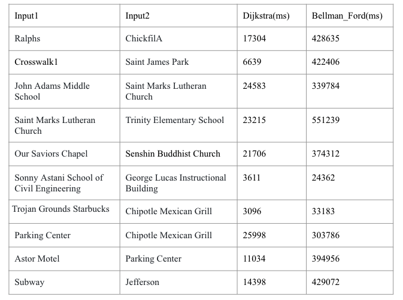</p>

<p align="center"></p>

As we can see from the picture, the runtime of Dijkstra is much less than the one of Bellman_Ford.


## Step4: The traveling Trojan Problem:
### 1. Brute force
In this section, we use Backtracking algorithm to solve Traveling Trojan Problem.

- While implementing backtracking, we use swap function to swap the positions of two nodes in the vector to get different permutations. We also set a pointer to record the index of swapping node. 
- When the pointer reaches the end of the vector, it means a route is found. Then we compare the route with current shortest path and do updates.

**Time complexity:** $O(n*n!)$. (n in Step4 represents the number of input nodes.)

We use ``swap`` instead of ``find``. Backtraing is implemented O(n!) times totally. And every time we find a shorter path, we use ``push_back`` to add the vector to the result, which costs O(n). Therefore, the time complexity of is $O(n*n!)$.

**Examples and Time taken by function:**
- 8 places
```shell
**************************************************************
* 4. Traveling salesman problem                              
**************************************************************

Please input the number of the places:8
**************************************************************
The distance of the path is:4.13595 miles
**************************************************************
You could find your animation at src/lib/output.avi.          
Time taken by function: 68035 microseconds
```
<p align="center">
  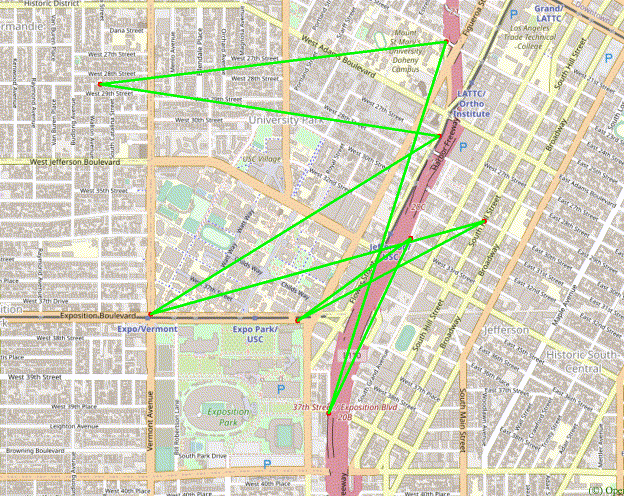
   
</p>


- 10 places
```shell
**************************************************************
* 4. Traveling salesman problem                              
**************************************************************

Please input the number of the places:10
**************************************************************
The distance of the path is:4.44844 miles
**************************************************************
You could find your animation at src/lib/output.avi.          
Time taken by function: 5852684 microseconds
```
<p align="center">
  
   
</p>


### 2. Backtracking
The backtracking algorithm is similar to the previous brute force algorithm. 
- We use a if statement to implement early backtracking. When the current distance is larger than the current minimum distance, we just skip the case and continue to the next permutation. Therefore, we can save the time.

**Time complexity:** $O(n*n!)$

**Examples and Time taken by function:**
- 10 places
```shell
**************************************************************
* 4. Traveling salesman problem                              
**************************************************************

Please input the number of the places:10
**************************************************************
The distance of the path is:4.71575 miles
**************************************************************
You could find your animation at src/lib/output.avi.          
Time taken by function: 347076 microseconds
```
<p align="center">
  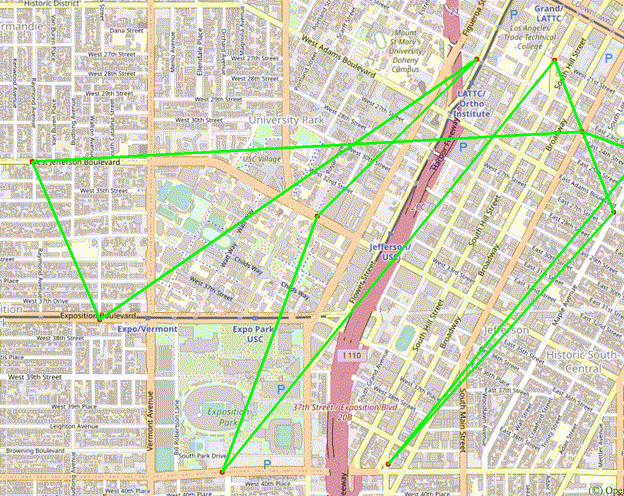
   
</p>

- 12 places
```shell
**************************************************************
* 4. Traveling salesman problem                              
**************************************************************

Please input the number of the places:12
**************************************************************
The distance of the path is:4.21632 miles
**************************************************************
You could find your animation at src/lib/output.avi.          
Time taken by function: 4221427 microseconds
```
<p align="center">
  
  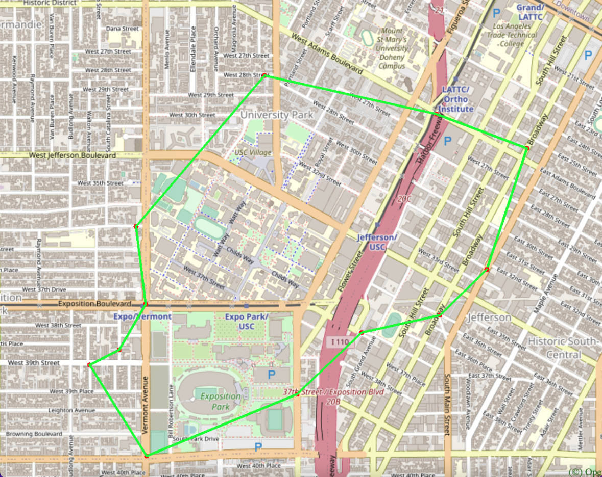 
</p>


### 3. 2-opt
In this section, we implement 2-opt algorithm to solve the Traveling Trojan Problem.
- We use swapping mechanism here, reversing part of the nodes to reorder them and get a new permutation. 
- Two for-loops are used to compare every possible possible route. If the new route is shorter, we continue to find the next route. While if it's longer, we will use the previous route to continue the loop.
- Break the loops while there is no updates to the shortest route.

**Time complexity:** each while loop is $O(n^2)$. We break the loop while there is no updates to the shortest route length. 

**Examples and Time taken by function:**
- 10 places
```shell
**************************************************************
* 4. Traveling salesman problem                              
**************************************************************

Please input the number of the places:10
**************************************************************
The distance of the path is:4.65398 miles
**************************************************************
You could find your animation at src/lib/output.avi.          
Time taken by function: 1713 microseconds
```
<p align="center">
  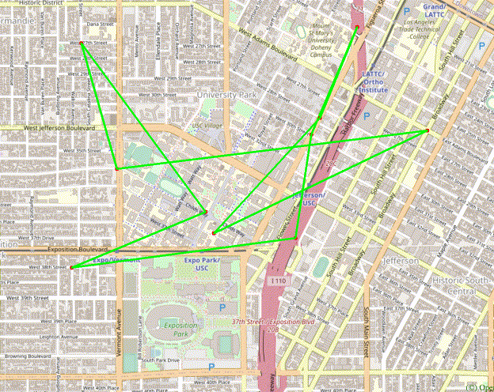
  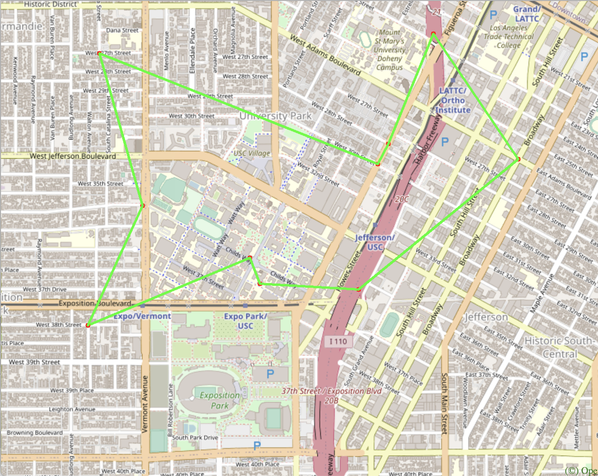 
</p>


- 20 places
```shell
**************************************************************
* 4. Traveling salesman problem                              
**************************************************************

Please input the number of the places:20
**************************************************************
The distance of the path is:6.67446 miles
**************************************************************
You could find your animation at src/lib/output.avi.          
Time taken by function: 16287 microseconds
```
<p align="center">
  
   
</p>


- 30 places
```shell
**************************************************************
* 4. Traveling salesman problem                              
**************************************************************

Please input the number of the places:30
**************************************************************
The distance of the path is:5.85451 miles
**************************************************************
You could find your animation at src/lib/output.avi.          
Time taken by function: 25583 microseconds
```
<p align="center">
  
   
</p>


- 40 places
```shell
**************************************************************
* 4. Traveling salesman problem                              
**************************************************************

Please input the number of the places:40
**************************************************************
The distance of the path is:9.81059 miles
**************************************************************
You could find your animation at src/lib/output.avi.          
Time taken by function: 146846 microseconds
```
<p align="center">
  
  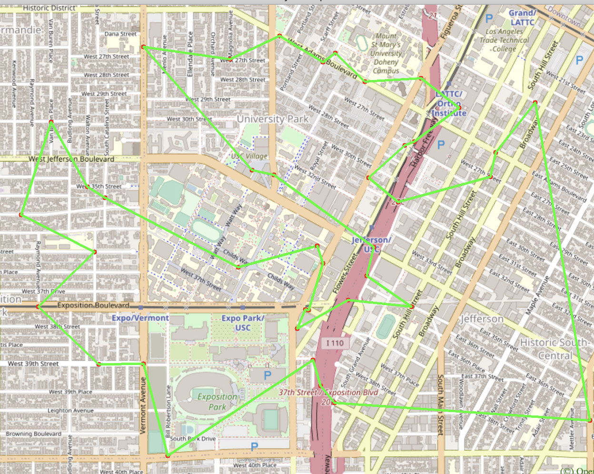 
</p>


- 50 places
```shell
**************************************************************
* 4. Traveling salesman problem                              
**************************************************************

Please input the number of the places:50
**************************************************************
The distance of the path is:9.24729 miles
**************************************************************
You could find your animation at src/lib/output.avi.          
Time taken by function: 370281 microseconds
```
<p align="center">
  
  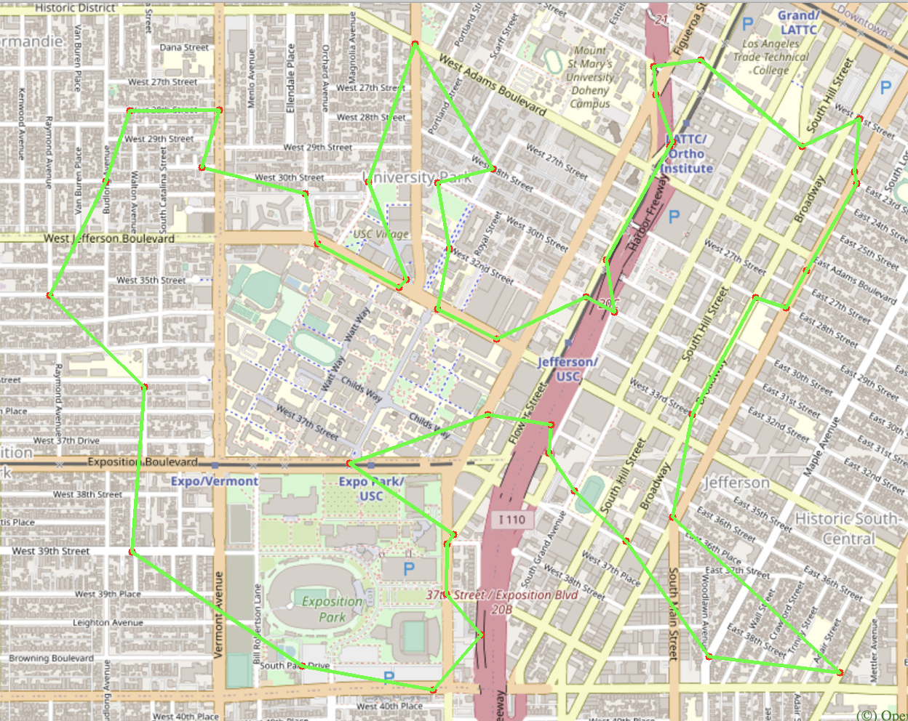 
</p>


### 4. 3-opt
In this section, we implement 3-opt algorithm, which is a little more complicated than 2-opt.
- We use three for loops to get three different nodes, whose index are i, j, k. i, j, k should satisfy i<j<k or j<k<i or k<i<j.
- Using these three nodes as three breaking points to the route. The route is seperated to three parts. We can then find eight different routes by reversing and swaping the three parts.
- If the length of the new route is shorter, we continue to find the new three nodes(index: i, j, j). Or we will check all the eight routes. When there is no update, we break the loops.

**Time complexity:** each while loop is $O(n^3)$. We break the loop while there is no updates to the shortest path length.

**Examples and Time taken by function:**
- 10 places
```shell
**************************************************************
* 4. Traveling salesman problem                              
**************************************************************

Please input the number of the places:10
**************************************************************
The distance of the path is:3.91414 miles
**************************************************************
You could find your animation at src/lib/output.avi.          
Time taken by function: 24456 microseconds
```
<p align="center">
  
   
</p>


- 20 places
```shell
**************************************************************
* 4. Traveling salesman problem                              
**************************************************************

Please input the number of the places:20
**************************************************************
The distance of the path is:6.34402 miles
**************************************************************
You could find your animation at src/lib/output.avi.          
Time taken by function: 286006 microseconds
```
<p align="center">
  
  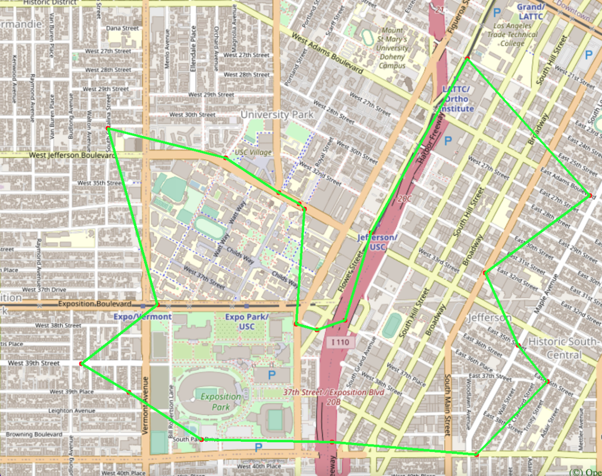 
</p>


- 30 places
```shell
**************************************************************
* 4. Traveling salesman problem                              
**************************************************************

Please input the number of the places:30
**************************************************************
The distance of the path is:7.61939 miles
**************************************************************
You could find your animation at src/lib/output.avi.          
Time taken by function: 891818 microseconds
```
<p align="center">
  
   
</p>


- 40 places
```shell
**************************************************************
* 4. Traveling salesman problem                              
**************************************************************

Please input the number of the places:40
**************************************************************
The distance of the path is:9.53303 miles
**************************************************************
You could find your animation at src/lib/output.avi.          
Time taken by function: 2111038 microseconds
```
<p align="center">
  
  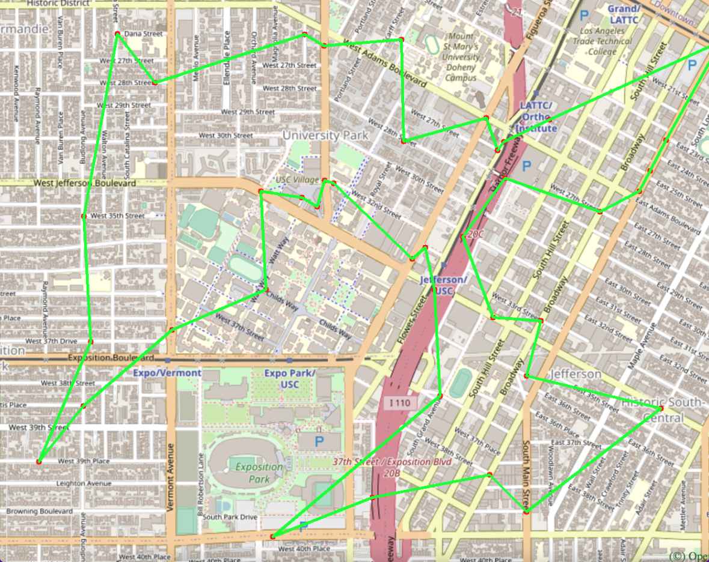 
</p>


- 50 places
```shell
**************************************************************
* 4. Traveling salesman problem                              
**************************************************************

Please input the number of the places:50
**************************************************************
The distance of the path is:9.86856 miles
**************************************************************
You could find your animation at src/lib/output.avi.          
Time taken by function: 7833522 microseconds
```
<p align="center">
  
  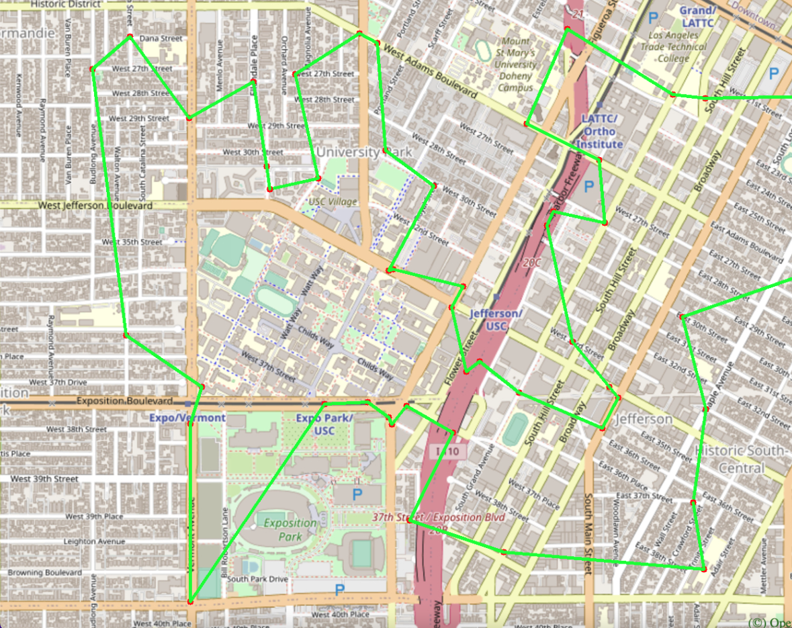 
</p>


### 5. Genetic
In this section, we implement genetic algorithm. We take location_ids as genes and routes as chromosomes/populations. 
- We set the population size as 7, so there will be 7 different routes in the populations.
- Then we iterate several generations. For every generation, all the populations will be updated.
- When each population is evolving, crossing over and mutating will take place. That is, swapping two different nodes of the route to get a new one. If the new route length is smaller, then the populatioin evolves. If not, there is still some probability that the population will update. 

**time complexity:** O(g*p*n) g is the number of generations. p is the number of populations. n is the number of nodes in a route.

We will update all the populations for several generations, which costs O(g*p). Each time we find a better route, we will use ``push_back`` to record the route, which costs O(n).

**Examples and Time taken by function:**
- 8 places
```shell
**************************************************************
* 4. Traveling salesman problem                              
**************************************************************

Please input the number of the places:8
**************************************************************
The distance of the path is:5.78925 miles
**************************************************************
You could find your animation at src/lib/output.avi.          
Time taken by function: 2105 microseconds
```
<p align="center">
  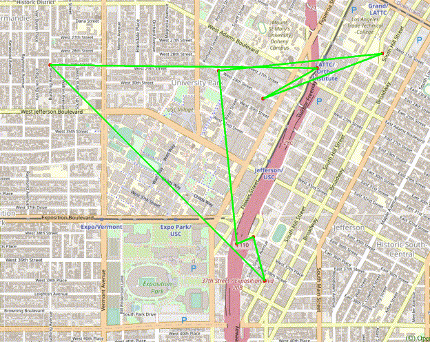
  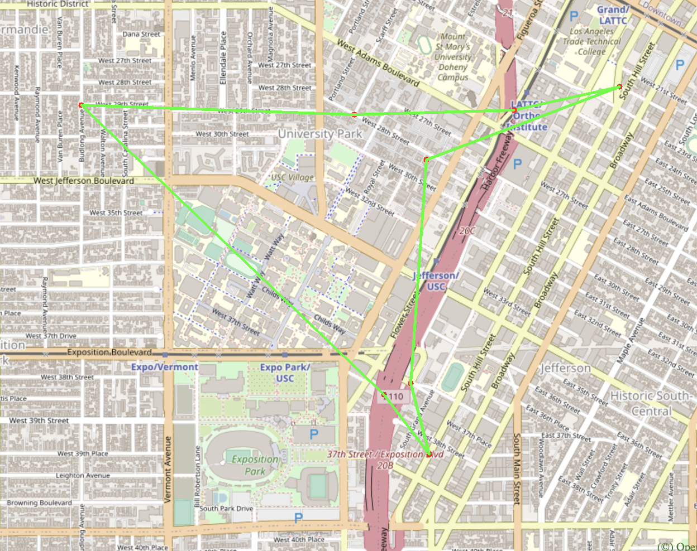 
</p>


- 10 places
```shell
**************************************************************
* 4. Traveling salesman problem                              
**************************************************************

Please input the number of the places:10
**************************************************************
The distance of the path is:5.75275 miles
**************************************************************
You could find your animation at src/lib/output.avi.          
Time taken by function: 2194 microseconds
```
<p align="center">
  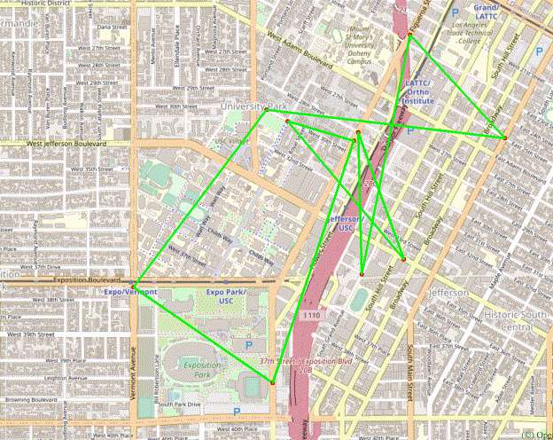
  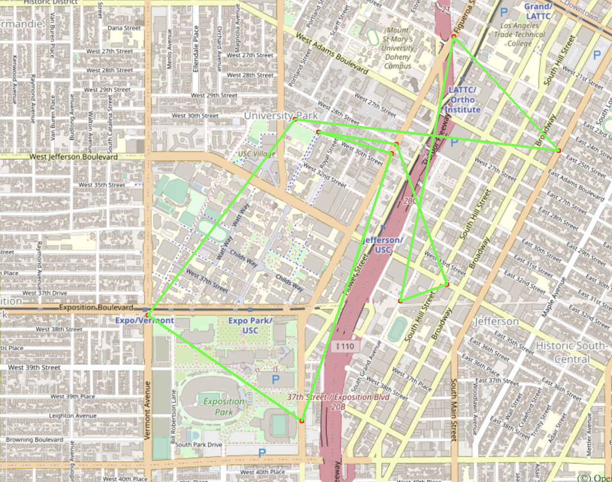 
</p>


### 6. Runtime compard between Brute force, backtracking, 2-opt, 3-opt and Genetic
We listed several examples to compare the runtime between Brute force, backtracking, 2-opt and Genetic.

<p align="center"></p>

<p align="center"></p>

<p align="center">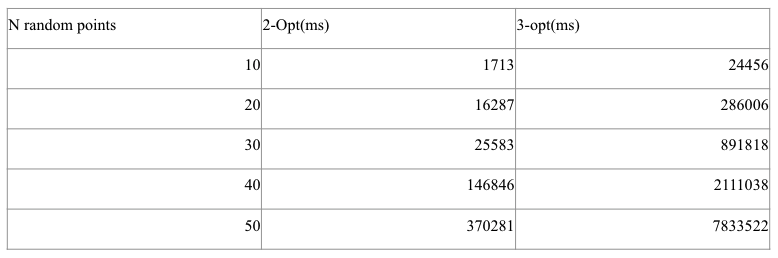</p>

<p align="center"></p>

As we can see, the runtime of brute force is much higher than others when the number of nodes get larger.

In this experiment, I run several cases using the above algorithms.
- For Bruteforce and Backtracking these kinds of exhaustive search, the results are definitely right, but it takes too long for the algorithms to run. When the number of places is bigger than 15, it will take more than 5 minutes. The exhaustive search is not practical for too many nodes.
- For 2-opt and 3-opt, I tried up to 50 inputs, and the results of the two algorithms are all optimal. They also don't need too much time to run. Therefore, when there are more than 15 inputs, the heuristic implementation is preferred.
- For genetic algorithm, although the running time is short, it cannot get the optimal result when the number of input is bigger than 10.

## Step5: Cycle detection:
For this section, we use a square-shaped subgraph of the original graph by using four corrdinates. And it follows the order of left, right, upper and lower bounds. We are tring to determine if there is a cycle path in that subgraph.

First, we can get the left, right, upper and lower bounds from the ```std::vector<double> square```. Second, we go through the data's latitude and longtitude to see any points are in the square and we push back to vector which named points. We are using DFS for the cycle detection, we need to consider the parent in the cycle detection incase there are two nodes that is detected as a cycle. Then, we use a map with booling named visited, we set every point in points are false. And go through all the points using recursive DFS. Eventually, we plot the path and square out.

**Time complexity:** $O(m+n)$. m represents the number of edges in the map and n represents the number of nodes.

Every nodes will be vistied only once, and for each node we only check its neighbor once. So, the maximum of conputations is only number of nodes and number of edges.

 **Examples and Time taken by function:**

Example 1:
```shell
Input: square = {-118.278,-118.267,34.028,34.015}
Output: true
```

```shell
**************************************************************
* 5. Cycle Detection                                          
**************************************************************
Please input the left bound longitude(between -118.299 and -118.264):-118.278
Please input the right bound longitude(between -118.299 and -118.264):-118.267
Please input the upper bound latitude(between 34.011 and 34.032):34.028
Please input the lower bound latitude(between 34.011 and 34.032):34.015
*************************Results******************************
there exists cycle in the subgraph 
**************************************************************
Time taken by function: 206059 microseconds
```

<p align="center"></p>

Example 2:
```shell
Input: square = {-118.294, -118.265, 34.031, 34.012}
Output: true
```

```shell
**************************************************************
* 5. Cycle Detection                                          
**************************************************************
Please input the left bound longitude(between -118.299 and -118.264):-118.294
Please input the right bound longitude(between -118.299 and -118.264):-118.265
Please input the upper bound latitude(between 34.011 and 34.032):34.031
Please input the lower bound latitude(between 34.011 and 34.032):34.012
*************************Results******************************
there exists cycle in the subgraph 
**************************************************************
Time taken by function: 264530 microseconds
```

<p align="center"></p>

## Step6: Topological Sort:
In this section, we are going to find the feasible route according to some dependencies. We mainly use DFS to realize Topological Sort.

- First, we initialize the edge map which contains the node and its neighbors and the mark map which is used to record whether the node has been marked.
- Then we use DFS and mark map to recursivly access every node in ```locations```. Through using DFS, we will get the deepest node first. Therefore, to get the final result, we need to reverse the original result obtained by DFS.

**Time complexity** If m>=n, it's O(m); if n>m, it's O(n). m represents the number of edges(the length of ```dependencies```). n represents the number of nodes in ```locations```.
Obtaining the edge map costs O(m). The time complexity of DFS is O(n).

**Examples and Time taken by function:**

Example 1:
```shell
Input: 
location_names = {"University Park", "Troy View Swimming Pool","CVS"}
dependencies = {{"University Park","Troy View Swimming Pool"}, {"Troy View Swimming Pool","CVS"}, {"University Park","CVS"}}
```

```shell
**************************************************************
* 6. Topological Sort                                         
**************************************************************
Please input the locations filename:/Users/yzj/EE538/final-project-ZijianYe/input/topologicalsort_locations.csv
Please input the dependencies filename:/Users/yzj/EE538/final-project-ZijianYe/input/topologicalsort_dependencies.csv
*************************Results******************************
Topological Sorting Results:
University Park
Troy View Swimming Pool
CVS
**************************************************************
Time taken by function: 56 microseconds
```

<p align="center">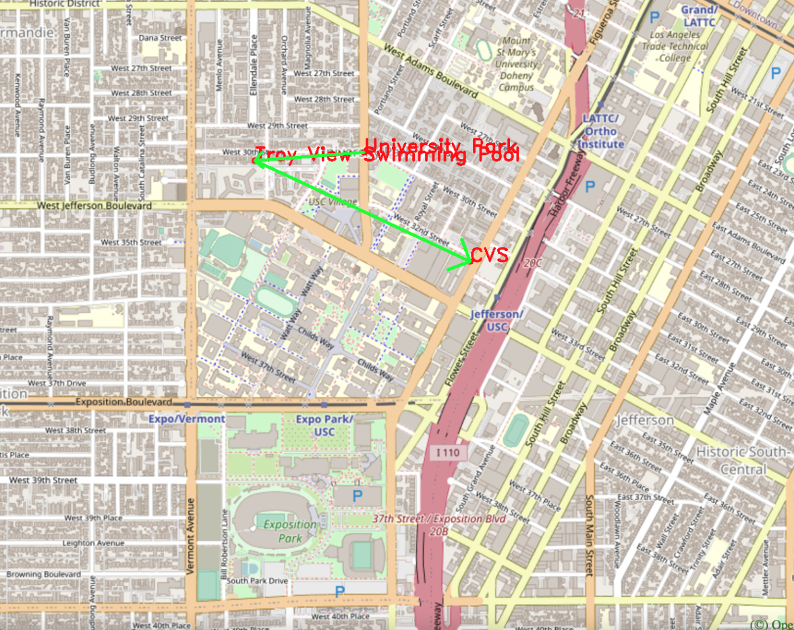</p>

Example 2:
```shell
Input: 
location_names = {"Saint Marks Lutheran Church", "Trinity Elementary School","Ralphs","Crosswalk1","Saint James Park","Vermont Elementary School","Community of Christ","Los Angeles","Divine Providence Convent","Parking Center"}
dependencies = {{"Saint Marks Lutheran Church","Trinity Elementary School"}, {"Saint Marks Lutheran Church","Ralphs"}, {"Saint Marks Lutheran Church","Crosswalk1"},{"Saint Marks Lutheran Church","Saint James Park"},{"Saint Marks Lutheran Church","Vermont Elementary School"},{"Saint Marks Lutheran Church","Community of Christ"},{"Saint Marks Lutheran Church","Los Angeles"},{"Saint Marks Lutheran Church","Divine Providence Convent"},{"Saint Marks Lutheran Church","Parking Center"},{"Trinity Elementary School","Ralphs"}, {"Trinity Elementary School","Crosswalk1"}, {"Trinity Elementary School","Saint James Park"}, {"Trinity Elementary School","Vermont Elementary School"}, {"Trinity Elementary School","Community of Christ"}, {"Trinity Elementary School","Los Angeles"}, {"Trinity Elementary School","Divine Providence Convent"}, {"Trinity Elementary School","Parking Center"},{"Ralphs","Crosswalk1"},{"Ralphs","Saint James Park"},{"Ralphs","Vermont Elementary School"},{"Ralphs","Community of Christ"},{"Ralphs","Los Angeles"},{"Ralphs","Divine Providence Convent"},{"Ralphs","Parking Center"},{"Crosswalk1","Saint James Park"},{"Crosswalk1","Vermont Elementary School"},{"Crosswalk1","Community of Christ"},{"Crosswalk1","Los Angeles"},{"Crosswalk1","Divine Providence Convent"},{"Crosswalk1","Parking Center"},{"Saint James Park","Vermont Elementary School"},{"Saint James Park","Community of Christ"},{"Saint James Park","Los Angeles"},{"Saint James Park","Divine Providence Convent"},{"Saint James Park","Parking Center"},{"Vermont Elementary School","Community of Christ"},{"Vermont Elementary School","Los Angeles"},{"Vermont Elementary School","Divine Providence Convent"},{"Vermont Elementary School","Parking Center"},{"Community of Christ","Los Angeles"},{"Community of Christ","Divine Providence Convent"},{"Community of Christ","Parking Center"},{"Los Angeles","Divine Providence Convent"},{"Los Angeles","Parking Center"},{"Divine Providence Convent","Parking Center"}}
```

```shell
**************************************************************
* 6. Topological Sort                                         
**************************************************************
Please input the locations filename:/Users/yzj/EE538/final-project-ZijianYe/input/topologicalsort_locations.csv
Please input the dependencies filename:/Users/yzj/EE538/final-project-ZijianYe/input/topologicalsort_dependencies.csv
*************************Results******************************
Topological Sorting Results:
Saint Marks Lutheran Church
Trinity Elementary School
Ralphs
Crosswalk1
Saint James Park
Vermont Elementary School
Community of Christ
Los Angeles
Divine Providence Convent
Parking Center
**************************************************************
Time taken by function: 183 microseconds
```

<p align="center">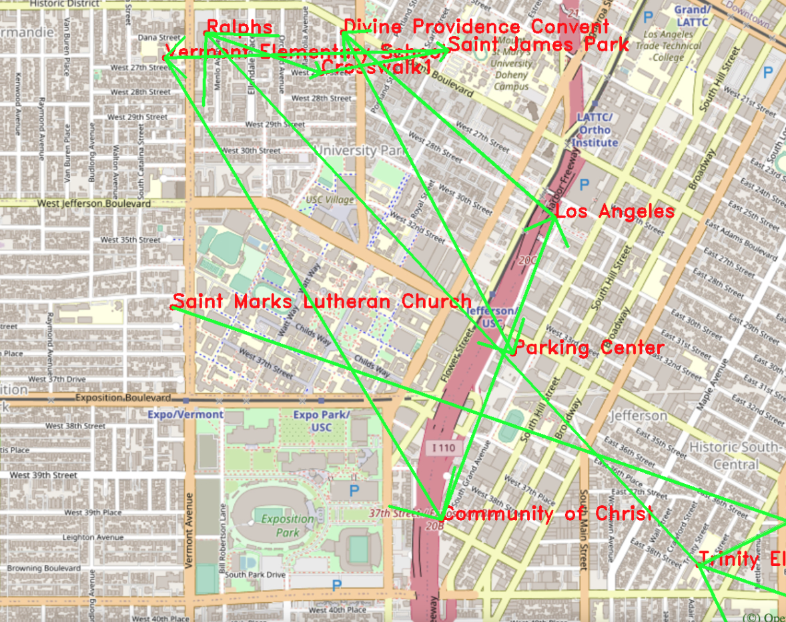</p>

As we can see, with the grows of input size, the runtime is not increase too much.

## Step7: Find K closest points:
For this section, we are going to find the k closest location with the name on the map and return a vector of string ids.

We are using heap for this section. First, we create a priority queue and set the return vector to be the k sizes. Then, we get the location name and the location's latitude and longitude. After that, we calculate the distance and put that in the queue. If the size of queue is equal to k size, then we compare the distance we calculated with the distance in the queue. If the distance we calculated is smaller than the distance in the queue. We replace it with the smallest one.

**time complexity:** $O(n*logk)$ n is the number of nodes in the map, k is the input parameter.

**Examples and Time taken by function:**

```shell
**************************************************************
* 7. Find K Closest Points                                    
**************************************************************

Please input the locations:Ralphs
Please input k:5
358794109: 0.121023
358828789: 0.105633
7158047272: 0.0997647
358791507: 0.0848742
3724125231: 0.0584317
*************************Results******************************
Find K Closest Points Results:
1 St Agnes Church
2 Saint Agnes Elementary School
3 Warning Skate Shop
4 Menlo AvenueWest Twentyninth Street Historic District
5 Vermont Elementary School
**************************************************************
Time taken by function: 6171 microseconds
```
<p align="center">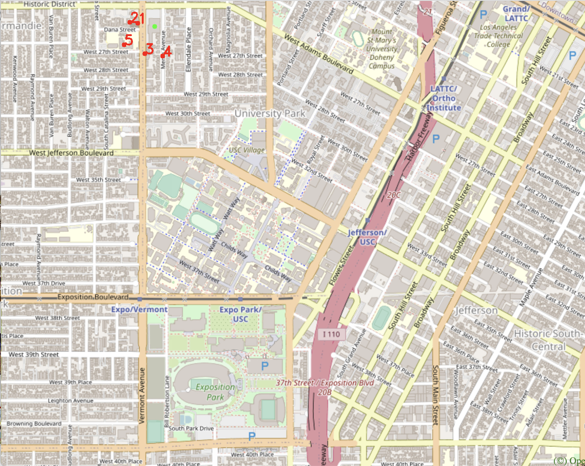</p>

```shell
**************************************************************
* 7. Find K Closest Points                                    
**************************************************************

Please input the locations:Moreton Fig
Please input k:7
2817034895: 0.0789534
2817034894: 0.0732835
4399693645: 0.0651576
2305853438: 0.0630711
2305853437: 0.0540357
5229911604: 0.0426097
5229911615: 0.0305817
*************************Results******************************
Find K Closest Points Results:
1 Student Union STU
2 Tutor Campus Center Piano
3 Traveler39s Fountain
4 Tommy Trojan
5 George Tirebiter
6 Allan Hancock Foundation
7 Newman Recital Hall in Hancock Foundation
**************************************************************
Time taken by function: 4952 microseconds
```
<p align="center">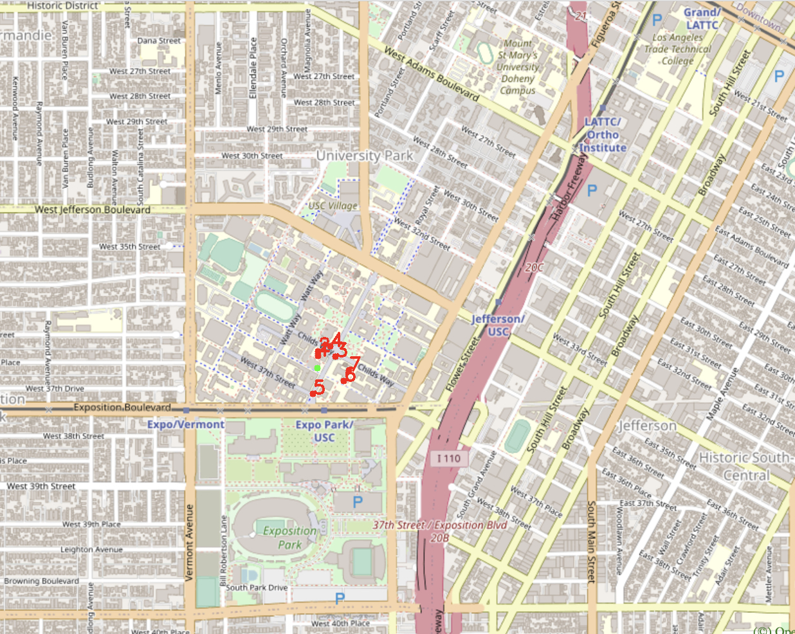</p>

## Discussion, conclusion and lessons learned
First, we are now familiar with the C++. We understand code to execution including tokenization, compiling and linking. And we can step-wise debug to analysis how to modify it. Besides, we know how to determine the time complexity and it can help us to know which way goes faster.

Second, we learned a lot of data structure such as vector, map, lists, graph, tree and so on. We did a lot of practice in the homework and went through some examples in the lecture. We are familiar with those data structure and if we have a question, we know which one we need to use. 

Third, we also learned a lot of algorithms such as sorting, backtracking and dynamic programming. We know how to use it and implement it into a practical problems. But we think we still need to do more questions to familar with it.

Last but not the least, we both think professor really did a great job that let us understand all the things deeply. Appreciated and thanks.

